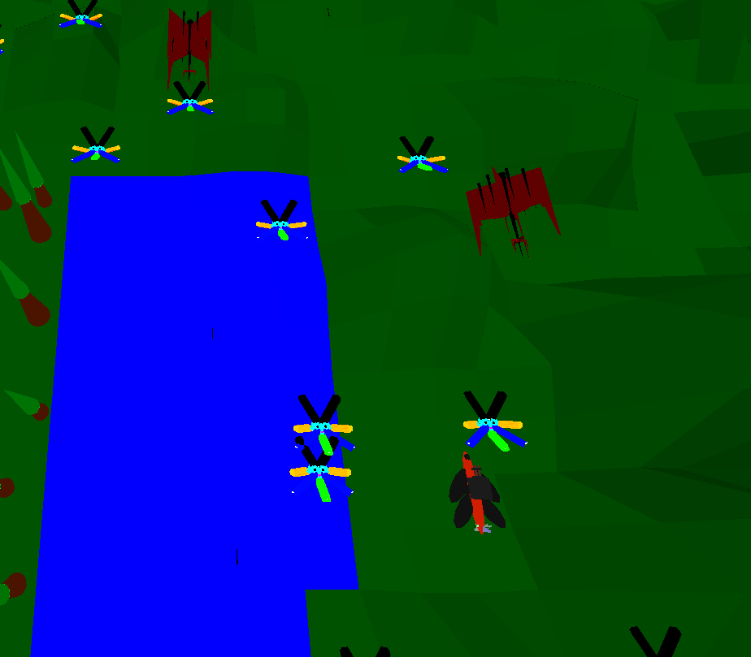
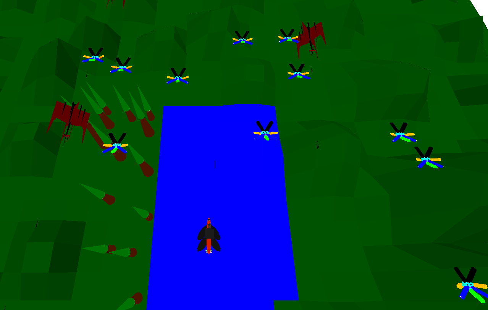

# What is this

This is a pretty cool shooter game that you can run on your browser. It has planes, bullets and monkey like objects. Pretty all over the place.

# How to Run

Start the `home.html` file using a live server (through VScode).

# Link to trailer

https://drive.google.com/file/d/10ogpSBj1Xa0_qJ5_T7ZS_5-aVIdpbZ7_/view?usp=sharing

# Controls

`wasd` - move player

`;` - shoot

# objects
- Player
- Enemy - They shoot bullets at you
- monke star - This is something you can collect to gain score

# About 

All models are in 3D, made using blender

The drones move randomly without colliding with each other. They also shoot bullets randomly. 

The player has 5 lives, and he loses a life every time he gets hit by an enemy bullet

Every time he collects a star he gains points

The background music is bomb, you might have to change some browser settings to hear it though.

# Gameplay

